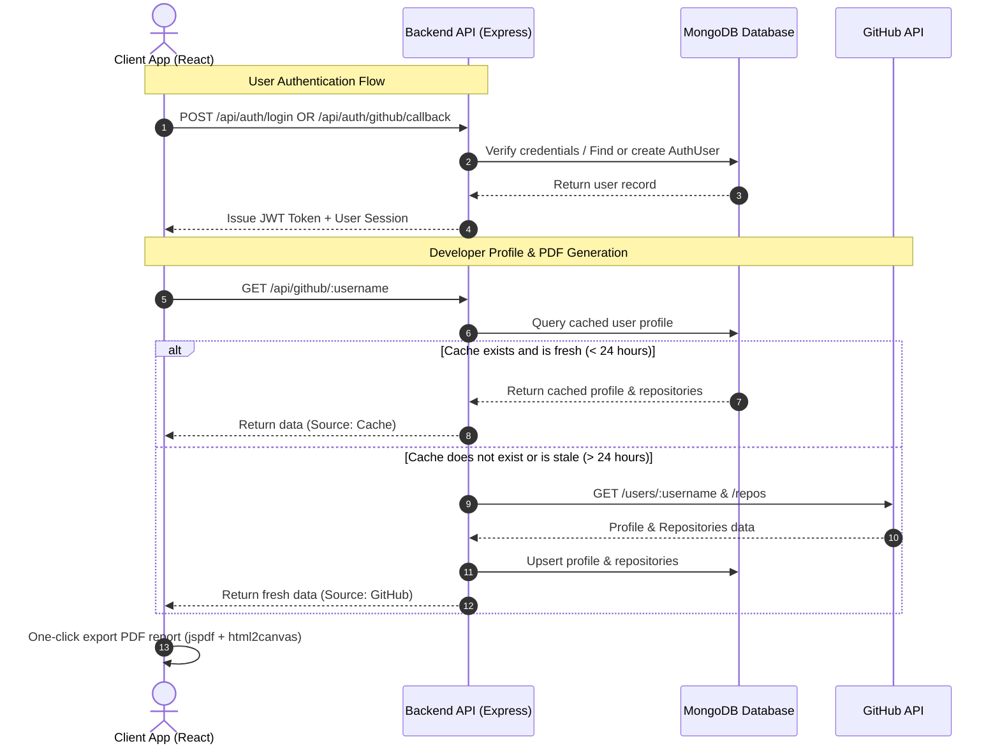

# GitPeek

GitPeek is a full-stack developer dashboard application for exploring GitHub profiles, statistics, and repositories. Built with React, Node.js, Express, and MongoDB, it implements a 24-hour cache synchronization layer to improve page load performance, bypass GitHub API rate limits, authenticate users (via GitHub OAuth or Email/Password), and export developer profile reports as formatted PDF resumes.

---

## System Architecture

The following diagram illustrates the workflow of GitPeek's core architecture, including API caching and authentication:



---

## Key Features

- **User-Connected Bookmarks & Deletion**: Logged-in users can bookmark profiles and repositories directly to their MongoDB user account. Features an interactive **Bookmarks Drawer** with filter tabs and explicit **Remove / Delete** buttons for each saved bookmark.
- **Dynamic Repository Detail View & README Viewer**: Interactive `/repo/:owner/:repo` page with full repo metrics (stars, forks, open issues, watchers, size in MB, license, default branch), language distribution progress bars, recent commit activity, and structured `README.md` renderer.
- **GitHub OAuth & Email/Password Authentication**: Secure authentication system supporting normal register/login via Email and Password (hashed with `bcryptjs` and secured with JWT tokens) as well as GitHub OAuth / instant GitHub profile linking.
- **Developer PDF Resume Exporter**: Export high-resolution, formatted PDF summary reports for any developer profile, detailing bio metrics, repository counts, total stars/forks, programming language distribution progress bars, and top featured projects.
- **Profile Search and Analytics**: Fetches comprehensive developer metadata, including biography, hireable flag, avatars, join dates, and follower metrics.
- **Repository Filtering & Sorting**: Client-side filtering by repository name/description, language classification, and sorting by Stars, Forks, Updated Date, or Alphabetical order.
- **24-Hour Caching Engine**: Auto-expires database entries after 24 hours, automatically refreshing profiles on subsequent searches while preserving rate limits.
- **Search History Tracker**: Logs search queries to provide tag-based links to recent profiles.
- **Theme-Consistent UI**: Spotify-inspired glassmorphic dark theme with custom styled dropdowns and responsive design.

---

## Tech Stack

### Frontend
- **React 19**: SPA framework
- **React Router 7**: Declarative routing
- **Vite 8**: Frontend build tool & dev server (with dynamic code-splitting)
- **Axios**: HTTP client with Bearer token interceptor
- **jspdf & html2canvas**: High-resolution client-side PDF document generation
- **React Icons**: SVG iconography
- **Vanilla CSS / CSS Modules**: Scoped styles adhering to a dark glassmorphic design system

### Backend
- **Node.js (ES Modules)**: JavaScript runtime
- **Express**: Web framework
- **MongoDB & Mongoose**: ODM database layer
- **jsonwebtoken & bcryptjs**: Password hashing and JWT session management
- **Axios**: GitHub REST API client

---

## Getting Started

### Prerequisites
- Node.js (version 18 or higher recommended)
- MongoDB Community Server (running locally or a remote MongoDB Atlas URI)

### Environment Configuration

#### Backend Configuration
Create a `.env` file in the `server` directory:

```env
PORT=5000
MONGODB_URI=mongodb://localhost:27017/github-explorer
GITHUB_API=https://api.github.com
JWT_SECRET=your_jwt_secret_key
# Optional GitHub OAuth App Credentials
GITHUB_CLIENT_ID=your_github_oauth_client_id
GITHUB_CLIENT_SECRET=your_github_oauth_client_secret
GITHUB_REDIRECT_URI=http://localhost:5173/auth/callback
```

#### Frontend Configuration
Create a `.env` file in the `frontend` directory:

```env
VITE_API_URL=http://localhost:5000/api
```

### Installation and Running

From the root directory of the project, run:

1. **Install dependencies**:
   ```bash
   npm run install-all
   ```

2. **Start frontend and backend concurrently**:
   ```bash
   npm run dev
   ```

   - React App: `http://localhost:5173`
   - Backend API: `http://localhost:5000`

---

## API Reference

### Authentication Endpoints (`/api/auth`)
| Method | Endpoint | Description |
|:---|:---|:---|
| `POST` | `/api/auth/register` | Register a new user account with Name, Email, and Password. |
| `POST` | `/api/auth/login` | Authenticate user with Email and Password, returning a JWT token. |
| `GET` | `/api/auth/github/url` | Resolves GitHub OAuth authorization redirect URL. |
| `POST` | `/api/auth/github/callback` | Exchanges GitHub authorization code or username for JWT session token. |
| `GET` | `/api/auth/me` | Fetches currently authenticated user details (Protected). |
| `POST` | `/api/auth/link-github` | Links a GitHub handle to the logged-in user profile (Protected). |
| `GET` | `/api/auth/bookmarks` | Fetches saved bookmarks for the authenticated user (Protected). |
| `POST` | `/api/auth/bookmarks` | Saves a new profile or repository bookmark to user account (Protected). |
| `DELETE` | `/api/auth/bookmarks/:targetId` | Deletes a saved bookmark from user account by targetId (Protected). |
| `GET` | `/api/auth/favorites` | Fetches saved favorite profiles for the authenticated user (Protected). |
| `POST` | `/api/auth/favorites` | Saves a favorite profile to user account (Protected). |
| `DELETE` | `/api/auth/favorites/:username` | Deletes a favorite profile from user account by username (Protected). |

### GitHub & Analytics Endpoints (`/api`)
| Method | Endpoint | Description |
|:---|:---|:---|
| `GET` | `/api/github/:username` | Resolves a profile, checking the MongoDB cache first. |
| `GET` | `/api/github/repo/:owner/:repo` | Fetches detailed repository metadata, formatted README.md, language breakdown, and commit history. |
| `POST` | `/api/github/refresh/:username` | Forces a fresh synchronization from GitHub, bypassing cache checks. |
| `GET` | `/api/users` | Lists cached user profiles stored in the database. |
| `GET` | `/api/history` | Lists recently searched usernames (limited to the last 12 entries). |
| `DELETE` | `/api/users/:id` | Purges a specific cached user and search logs. |


